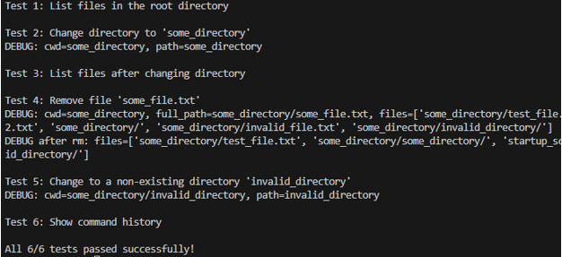

# Shell Emulator

## Описание

Этот проект реализует эмулятор оболочки, который позволяет пользователям взаимодействовать с виртуальной файловой системой, содержащейся в ZIP-архиве. Эмулятор поддерживает основные команды оболочки, позволяя пользователям навигировать по директориям, управлять файлами и просматривать историю команд.

## Структура файлов

Проект состоит из следующих файлов:

- `shell_emulator.py`: Содержит реализацию эмулятора оболочки.
- `test_shell_emulator.py`: Содержит тесты для проверки функциональности эмулятора.
- `config.json`: Содержит параметры конфигурации, такие как имя компьютера, путь к архиву виртуальной файловой системы и путь к стартовому скрипту.

## Функциональность

Эмулятор оболочки поддерживает следующие команды:

- **ls**: Выводит файлы и директории в текущей рабочей директории.
- **cd <путь>**: Изменяет текущую рабочую директорию.
- **exit**: Выходит из эмулятора оболочки.
- **rm <файл>**: Удаляет указанный файл из текущей рабочей директории.
- **rmdir <директория>**: Удаляет указанную директорию из текущей рабочей директории.
- **history**: Отображает историю команд.
- **clear**: очистка консоли
- **head**: вывод первых 10 строчек из файла


## Описание классов

### `ShellEmulator`

Основной класс, реализующий эмулятор оболочки.

#### Методы:
- **`__init__(self, config_path)`**: Инициализирует эмулятор с конфигурационным файлом.
- **`load_config(self, config_path)`**: Загружает параметры конфигурации из файла JSON.
- **`load_virtual_fs(self)`**: Загружает виртуальную файловую систему из указанного ZIP-архива.
- **`run_startup_script(self)`**: Выполняет команды из стартового скрипта, найденного в ZIP-архиве.
- **`execute_command(self, command)`**: Парсит и выполняет данную команду.
- **`ls(self)`**: Выводит содержимое текущей рабочей директории.
- **`cd(self, path)`**: Изменяет текущую рабочую директорию.
- **`rm(self, path)`**: Удаляет файл из текущей рабочей директории.
- **`rmdir(self, path)`**: Удаляет директорию из текущей рабочей директории.
- **`show_history(self)`**: Отображает историю выполненных команд.
- **`exit_shell(self)`**: Выходит из эмулятора.
- **`show_output(self, output)`**: Выводит текст в консоль.

## Запуск эмулятора

### Предварительные требования

Убедитесь, что у вас установлен Python 3.x и необходимые библиотеки:

- `zipfile`
- `os`
- `json`
- `shutil`
- `tkinter`

### Запуск эмулятора

Чтобы запустить эмулятор оболочки, выполните следующую команду:

```bash
python shell_emulator.py
```
#### Результаты ввода команд пользователем:


Чтобы запустить тесты эмуляторя оболочки, выполните следующую команду:

```bash
python test_shell_emulator.py
```

#### Результаты тестирования:



