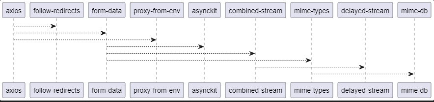

# Визуализатор графа зависимостей npm-пакетов

## Общее описание
Этот проект реализует инструмент командной строки для визуализации графа зависимостей npm-пакетов, включая транзитивные зависимости. Граф зависимостей создаётся в формате **PlantUML** и выводится на экран в виде графического изображения.

Инструмент полезен для анализа зависимостей JavaScript-пакетов, позволяя легко визуализировать их структуру.

---

## Функциональность
Визуализатор предоставляет следующие функции:
1. Извлечение зависимостей указанного npm-пакета без использования сторонних средств.
2. Рекурсивное построение транзитивных зависимостей.
3. Генерация графа зависимостей в формате **PlantUML**.
4. Отображение графа зависимостей в виде изображения с использованием заданного визуализатора.

---

## Структура файлов
```plaintext
npm-dependency-visualizer/
├── src/
│   ├── __init__.py              # Индикатор модуля Python
│   ├── dependency_graph.py      # Логика построения графа зависимостей
│   ├── plantuml_generator.py    # Генерация PlantUML-описания графа
│   └── cli.py                   # Обработка командной строки
├── tests/
│   ├── __init__.py              # Индикатор модуля тестов
│   ├── test_dependency_graph.py # Тесты для dependency_graph.py
│   ├── test_plantuml_generator.py # Тесты для plantuml_generator.py
│   └
├── data/
│   └── package_dependencies.json # JSON-файл с результатами анализа зависимостей npm
├── graph.puml                   # Временный файл с описанием PlantUML-графа (создается автоматически)
├
├── README.md                    # Описание проекта
├── requirements.txt             # Зависимости Python (если используются сторонние библиотеки)
└── main.py                      # Основной файл запуска
```
---

## Описание функций

### Основные функции:


### `get_npm_dependencies(package_name)`
Извлекает зависимости указанного npm-пакета.

**Параметры:**
- `package_name` (строка): Имя анализируемого пакета.

**Возвращает:**
- Словарь зависимостей указанного пакета.

**Особенности:**
- Использует команду `npm view` для получения данных.

---

### `save_dependencies_to_file(package_name, dependencies, file_path="data/package_dependencies.json")`
Сохраняет зависимости пакета в файл JSON.

**Параметры:**
- `package_name` (строка): Имя пакета.
- `dependencies` (словарь): Зависимости пакета.
- `file_path` (строка): Путь для сохранения JSON-файла.

**Результат:**
- Данные сохраняются на диск для последующего использования.

---

### `load_dependencies_from_file(package_name, file_path="data/package_dependencies.json")`
Загружает зависимости из файла JSON, если они существуют.

**Параметры:**
- `package_name` (строка): Имя пакета.
- `file_path` (строка): Путь к JSON-файлу.

**Возвращает:**
- Словарь зависимостей, если они найдены, иначе `None`.

---

### `build_dependency_graph(package_name, visited=None)`
Рекурсивно строит граф зависимостей, включая транзитивные зависимости.

**Параметры:**
- `package_name` (строка): Имя анализируемого пакета.
- `visited` (словарь): Список уже обработанных пакетов для предотвращения зацикливания.

**Возвращает:**
- Граф зависимостей в виде словаря.

**Особенности:**
- Проверяет и использует данные из кэша, если они доступны.

---

### `flatten_dependencies(package_name, dependencies, graph=None)`
Преобразует вложенные зависимости в плоский граф.

**Параметры:**
- `package_name` (строка): Имя пакета.
- `dependencies` (словарь): Вложенные зависимости.
- `graph` (словарь): Плоский граф зависимостей (по умолчанию создаётся новый).

**Возвращает:**
- Плоский граф зависимостей.

---

### `generate_plantuml_content(graph)`
Генерирует текстовое представление графа зависимостей в формате PlantUML.

**Параметры:**
- `graph` (словарь): Граф зависимостей.

**Возвращает:**
- Строку с описанием графа в формате PlantUML.

---

### `generate_graph_image(plantuml_content, visualizer_path)`
Создаёт изображение графа зависимостей.

**Параметры:**
- `plantuml_content` (строка): Код графа в формате PlantUML.
- `visualizer_path` (строка): Путь к программе PlantUML.

**Результат:**
- Генерирует файл `graph.png`, содержащий изображение графа.

**Особенности:**
- Временный файл `graph.puml` создаётся для передачи данных в PlantUML.

---

### Запуск программы 

```bash
python main.py --package-name axios
```



### Запуск тестов 

```bash
pytest
```
